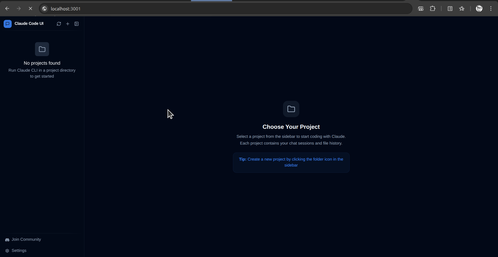

# CloudCLI Docker Deployment

A containerized deployment of [CloudCLI](https://github.com/cloudcli-ai/cloudcli) - an AI-powered coding assistant that runs in your browser. This setup includes automatic user provisioning and database seeding for seamless OAuth2 integration.



## Features

- 🐳 **Dockerized Deployment** - Easy to deploy and manage
- 👤 **Automatic User Seeding** - Pre-configured user provisioning from OAuth2 headers
- 🗄️ **SQLite Database** - Persistent user data storage
- 🚀 **Production Ready** - Built on Node.js 22 with optimized dependencies

## Project Structure

```
cloudcli/
├── Dockerfile          # Multi-stage Docker build configuration
├── seed-user.js        # User provisioning script for OAuth2 integration
└── README.md          # This file
```

## Prerequisites

- Docker installed on your system
- Port 3001 available on your host machine

## Quick Start

### Build the Docker Image

```bash
docker build -t my-cloudcli .
```

### Run the Container

```bash
docker run -d -p 3001:3001 --name cloudcli-container my-cloudcli
```

The application will be available at `http://localhost:3001`

## Configuration

### Environment Variables

The container supports the following environment variables:

| Variable | Default | Description |
|----------|---------|-------------|
| `X_AUTH_REQUEST_USER` | `admin` | Username from OAuth2 proxy |
| `X_AUTH_REQUEST_EMAIL` | `admin@example.com` | Email from OAuth2 proxy |
| `DATABASE_PATH` | `/root/.cloudcli/auth.db` | SQLite database location |
| `VITE_IS_PLATFORM` | `true` | Platform mode flag |

### Custom User Provisioning

To provision a custom user, pass environment variables when running the container:

```bash
docker run -d -p 3001:3001 \
  -e X_AUTH_REQUEST_USER=youruser \
  -e X_AUTH_REQUEST_EMAIL=your@email.com \
  --name cloudcli-container \
  my-cloudcli
```

## How It Works

1. **Container Startup**: The container starts with Node.js 22 and required dependencies
2. **User Seeding**: `seed-user.js` runs automatically to provision users from OAuth2 headers
3. **Database Initialization**: SQLite database is created with the users table schema
4. **CloudCLI Launch**: The CloudCLI server starts on port 3001

## User Seeding

The `seed-user.js` script automatically:
- Creates the SQLite database and users table if they don't exist
- Checks for existing users based on OAuth2 headers
- Provisions new users with OAuth2-managed authentication
- Sets up git configuration (name and email) for each user
- Marks users as having completed onboarding

## Docker Container Management

### View Logs

```bash
docker logs cloudcli-container
```

### Stop the Container

```bash
docker stop cloudcli-container
```

### Start the Container

```bash
docker start cloudcli-container
```

### Remove the Container

```bash
docker rm cloudcli-container
```

### Rebuild and Restart

```bash
docker stop cloudcli-container
docker rm cloudcli-container
docker build -t my-cloudcli .
docker run -d -p 3001:3001 --name cloudcli-container my-cloudcli
```

## Persistent Data

To persist user data across container restarts, mount a volume:

```bash
docker run -d -p 3001:3001 \
  -v cloudcli-data:/root/.cloudcli \
  --name cloudcli-container \
  my-cloudcli
```

## Technology Stack

- **Runtime**: Node.js 22 (Debian Bookworm Slim)
- **Database**: SQLite3 with better-sqlite3 driver
- **Build Tools**: Python3, Make, G++ (for native dependencies)
- **Application**: @cloudcli-ai/cloudcli

## Troubleshooting

### Port Already in Use

If port 3001 is already in use, map to a different port:

```bash
docker run -d -p 8080:3001 --name cloudcli-container my-cloudcli
```

### Database Issues

Check the database initialization logs:

```bash
docker logs cloudcli-container | grep BOOTSTRAP
```

### Container Won't Start

Verify the container status and logs:

```bash
docker ps -a
docker logs cloudcli-container
```

## License

This deployment configuration is provided as-is. CloudCLI itself is subject to its own license terms.

## Contributing

Feel free to submit issues and enhancement requests!

## Author

Rajendra M. (01.r.machani@gmail.com)
